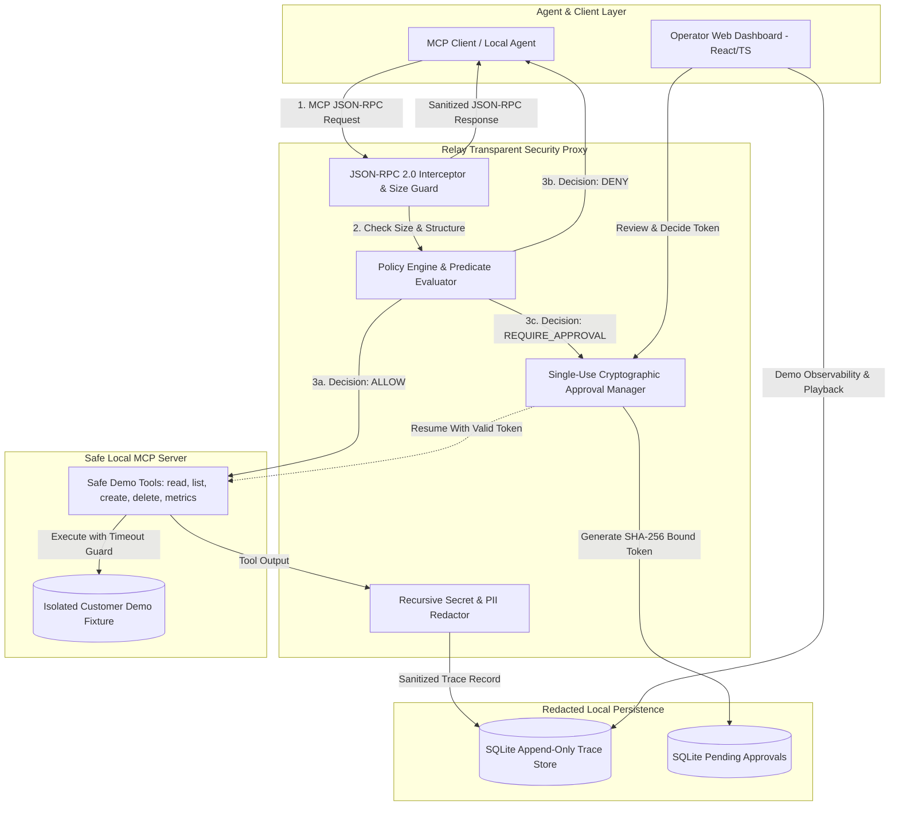

# Relay — Local MCP Safety & Observability Lab

> **A portfolio prototype demonstrating deterministic policy enforcement, single-use cryptographic approval gating, recursive secret redaction, and append-only trace observability for Model Context Protocol (MCP) tool execution.**

[](backend/tests)
[](backend)
[](https://fastapi.tiangolo.com)
[](frontend)
[](frontend)

---

## ⚠️ Honesty & Prototype Disclosures

- **Status:** **Portfolio prototype / safety lab**. Relay is **not production-ready** and makes no claims of enterprise scale or distributed fault tolerance.
- **Zero Real Keys Required:** Relay runs **100% locally**. It never calls external paid APIs (no real OpenAI, Anthropic, or external services).
- **Synthetic Components:** Provider simulations (Fast vs Strict) and token spend pricing models are **explicitly synthetic proxies** designed to benchmark policy and proxy behavior safely.
- **No Fabricated Benchmarks:** All reported latency metrics must be empirically measured on your machine using the included benchmark runner.

---

## 1. The Problem

### Why this project is in the portfolio

The saved job research contains 329 postings; 122 contain agent/AI, observability, guardrail, human-review, policy, or related signals. That pattern is why Relay was added: it gives the portfolio a concrete example of treating agent tool use as an engineering and operations problem, rather than presenting a generic chatbot demo. The project remains deliberately small and honest.

Autonomous AI agents equipped with Model Context Protocol (MCP) tool-calling capabilities introduce critical operational and security risks:
1. **Destructive Tool Invocations:** Agents can attempt irreversible mutations (e.g., dropping customer records or issuing destructive API calls) without operator consent.
2. **Credential & PII Leakage:** Prompts, agent parameters, and tool outputs frequently contain API keys, bearer tokens, or sensitive user data that end up permanently stored in plaintext observability logs.
3. **Runaway Loops & Spend:** Unbounded agent reasoning loops can exhaust session budgets and overwhelm backend systems.
4. **Approval Replay & Tampering:** Insecure human-in-the-loop systems often permit approval tokens to be replayed or applied to altered parameters.

**Relay solves this** by acting as a transparent MCP JSON-RPC security proxy that validates request sizes, evaluates sequential policies and argument predicates, enforces single-use cryptographic token binding, sanitizes credentials before persistence, and records append-only traces with deterministic playback.

---

## 2. Architecture



---

## 3. Quick Start (Run in 2 Minutes)

The dashboard starts empty by design. Click **Run safe walkthrough** to create synthetic traces for safe reads, discovery, a blocked shell call, and redaction. The deletion gate is deliberately manual so the operator can inspect and approve it. These rows are local demo evidence, not production traffic.

### Option A: Local Python & Node (Recommended)

#### 1. Start Backend
```bash
# In first terminal:
cd backend
pip install -r requirements.txt
uvicorn app.main:app --reload --host 127.0.0.1 --port 8000
```

#### 2. Start Frontend Dashboard
```bash
# In second terminal:
cd frontend
npm install
npm run dev
```
Open **`http://localhost:5173`** in your browser.

---

### Option B: One-Command Terminal Demo (Zero Web Setup)

Run the automated interactive guided scenario script directly:
```bash
python scripts/run_demo.py
```

---

### Option C: Docker Compose

```bash
docker compose up --build
```
Access the dashboard at **`http://localhost:5173`** and the API at **`http://localhost:8000`**.

---

## 4. Guided Demo Steps & Expected Behavior

| Step | Scenario | Invoked Tool | Policy Decision | Expected System Action |
|---|---|---|---|---|
| **1** | **Safe Read** | `read_record` | `ALLOW` (Low Risk) | Automatically executed against the local SQLite fixture; trace logged. |
| **2** | **Discovery** | `list_records` | `ALLOW` (Low Risk) | Safe tool discovery is recorded. |
| **3** | **Destructive Gate** | `delete_record` | `REQUIRE_APPROVAL` | Execution **pauses** and issues a single-use approval token. |
| **4** | **Critical Block** | `system_shell_exec` | `DENY` (Critical) | Prohibited command is blocked by the local policy engine. |
| **5** | **Secret Redaction** | `create_record` | `ALLOW` | API keys, bearer tokens, and emails are sanitized before SQLite storage. |

The approval flow is completed separately in the dashboard: inspect the pending request, approve or deny it, then test replay protection by reusing the consumed token.

---

## 5. Threat Model & Security Guarantees

### Mitigations
- **Parameter Tampering & Replay Attacks:** Approval tokens are cryptographically bound via `SHA-256(trace_id:session_id:tool_name:canonical_args_json)`. Modifying any argument or reusing the token invalidates it immediately.
- **Credential Storage Leakage:** All parameters and execution responses undergo recursive redaction (matching API keys, JWTs, PEM private keys, bearer tokens, passwords, cookies, and email addresses) before writing to SQLite traces.
- **Resource Exhaustion & Hangs:** Enforces an upper bound on JSON-RPC payload size (`1 MB`) and a strict local execution timeout deadline (`5.0s`).
- **Session Spend Ceilings:** Tracks cumulative simulated spend per session and triggers hard `DENY` when session thresholds are exceeded.

### Known Prototype Limitations
- **Not a Production Multi-Tenant Sandbox:** Local demo tools execute within the host Python process against isolated SQLite tables, not inside microVMs (e.g., Firecracker) or gVisor sandboxes.
- **Heuristic Pattern Redaction:** Regex-based sanitizers can miss unstructured, non-standard high-entropy tokens without common prefixes.
- **Single Node State:** Approval state and traces reside in a local SQLite file without distributed consensus or KMS secret signing. Hosted instances can lose this state when the container is replaced or scaled down.
- **No external MCP provider:** The checked demo uses safe local fixtures. It is not evidence that Relay has been integrated with a third-party MCP server.

---

## 6. Empirical Wall-Clock Latency Benchmark

Relay includes a dedicated benchmarking tool that measures the real wall-clock overhead introduced by the proxy layer (JSON-RPC deserialization, policy rule evaluation, predicate matching, recursive secret redaction, and SQLite append-only trace disk persistence) vs direct in-process tool execution.

### Run Benchmark
```bash
python scripts/benchmark.py 25
```

### Observed Local Run

The following values are from one checked-in benchmark run with **10 iterations** on Windows loopback using the local SQLite fixture. They are measurements of that run, not a production SLA.

```text
iterations: 10
direct_latency_ms: mean 3.751, median 3.668, min 3.433, max 4.385
proxied_latency_ms: mean 20.442, median 20.373, min 19.563, max 22.306
overhead_latency_ms: mean 16.691, percentage_increase 445.0
is_measured: true
```

The result is intentionally visible: this version prioritizes policy correctness and traceability, and its local persistence overhead is significant. Profile serialization, SQLite commits, and redaction work before claiming an optimization.

---

## 7. Verification & Test Suite

Relay includes unit, integration, policy, redaction, replay determinism, and approval lifecycle tests:

```bash
# Run backend pytest suite (28 passing tests)
cd backend && pytest tests -v

# Run frontend typechecking
cd frontend && npm run lint

# Run frontend production build
cd frontend && npm run build
```

---

## 8. Honest Roadmap

- [ ] **Transport Diversification:** Implement Server-Sent Events (SSE) and WebSocket MCP transport listeners in addition to JSON-RPC stdio.
- [ ] **Hardware KMS Token Signing:** Sign approval tokens using Ed25519 / asymmetric keys rather than HMAC hashes.
- [ ] **Wasm / Container Sandbox Isolation:** Execute third-party MCP tool plugins within WebAssembly or containerized sandboxes.
- [ ] **OpenTelemetry Export:** Stream sanitized append-only trace spans to OpenTelemetry (OTel) collectors and Jaeger backends.

---

## License

MIT License. Designed for safety research, demonstrations, and portfolio evaluation.
